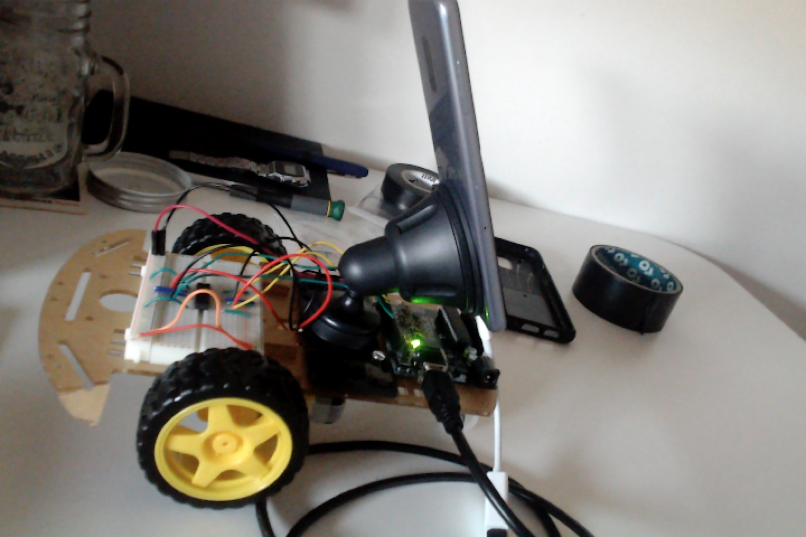
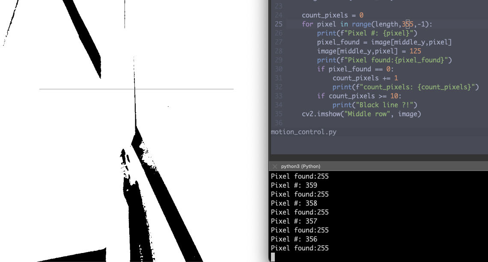
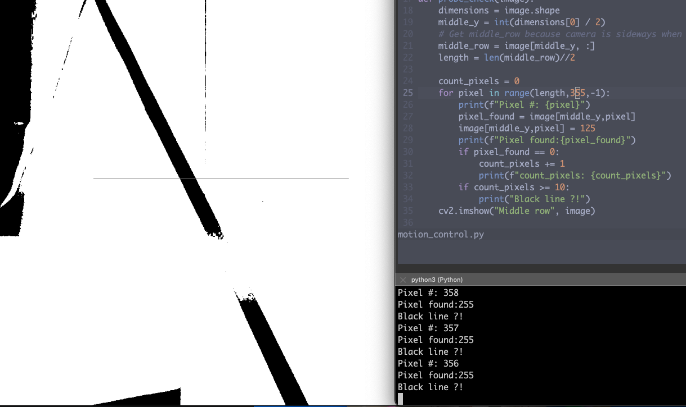
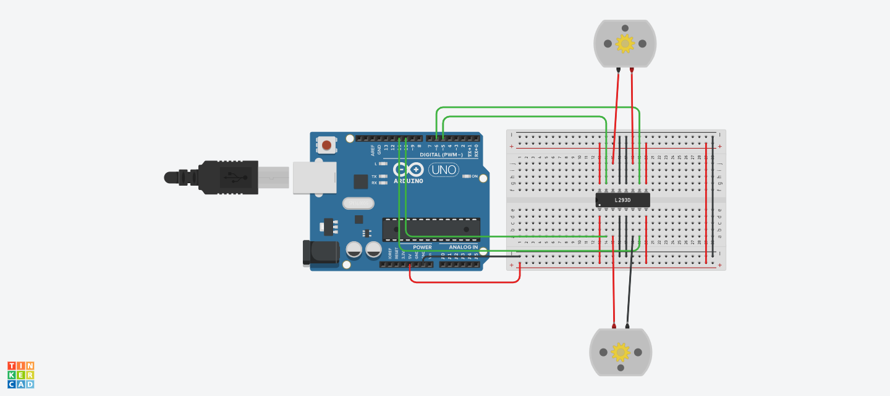

# Self Driving Toy

# Steps

Simple Circuit

PC to Arduino

PC to Smartphone to Arduino (Changed car)

Otsu Binarization with simple detection of a black line

_no line detected_

_line detected_

# Circuitry

- Arduino Uno
- 1 L293D
- 1 Breadboard
- 2 DC motors
- Lot of wires

# Useful Links

- [YouTube video that inspired me](https://www.youtube.com/watch?v=qgJ5HCFZbT0)
